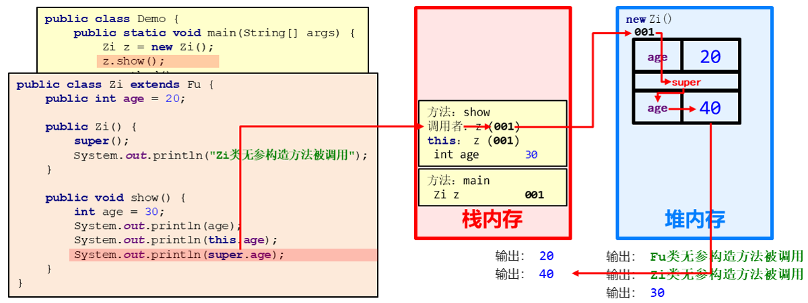
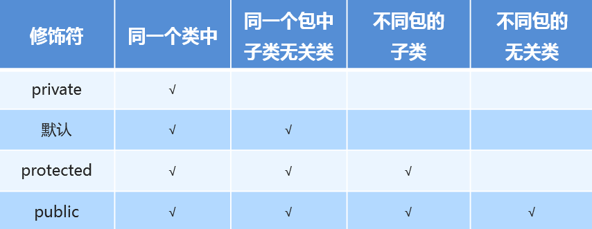

## 1. 继承

### 1.1 继承的实现（掌握）

* 继承的概念

  * 继承是面向对象三大特征之一，可以使得子类具有父类的属性和方法，还可以在子类中重新定义，以及追加属性和方法

* 实现继承的格式

  * 继承通过extends实现
  * 格式：class 子类 extends 父类 { } 
    * 举例：class Dog extends Animal { }

* 继承带来的好处

  * 继承可以让类与类之间产生关系，子父类关系，产生子父类后，子类则可以使用父类中非私有的成员。

* 示例代码

  ```java
  public class Fu {
      public void show() {
          System.out.println("show方法被调用");
      }
  }
  public class Zi extends Fu {
      public void method() {
          System.out.println("method方法被调用");
      }
  }
  public class Demo {
      public static void main(String[] args) {
          //创建对象，调用方法
          Fu f = new Fu();
          f.show();
  
          Zi z = new Zi();
          z.method();
          z.show();
      }
  }
  ```

### 1.2 继承的好处和弊端（理解）

* 继承好处
  * 提高了代码的复用性(多个类相同的成员可以放到同一个类中)
  * 提高了代码的维护性(如果方法的代码需要修改，修改一处即可)
* 继承弊端
  * 继承让类与类之间产生了关系，类的耦合性增强了，当父类发生变化时子类实现也不得不跟着变化，削弱了子类的独立性
* 继承的应用场景：
  * 使用继承，需要考虑类与类之间是否存在is..a的关系，不能盲目使用继承
    *  is..a的关系：谁是谁的一种，例如：老师和学生是人的一种，那人就是父类，学生和老师就是子类

## 2. 继承中的成员访问特点

### 2.1 继承中变量的访问特点（掌握）

在子类方法中访问一个变量，采用的是就近原则。

1. 子类局部范围找
2. 子类成员范围找
3. 父类成员范围找
4. 如果都没有就报错(不考虑父亲的父亲…)

* 示例代码

  ```java
  class Fu {
      int num = 10;
  }
  class Zi {
      int num = 20;
      public void show(){
          int num = 30;
          System.out.println(num);
      }
  }
  public class Demo1 {
      public static void main(String[] args) {
          Zi z = new Zi();
          z.show();	// 输出show方法中的局部变量30
      }
  }
  ```

### 2.2 super（掌握）

* this&super关键字：
  * this：代表本类对象的引用
  * super：代表父类存储空间的标识(可以理解为父类对象引用)
* this和super的使用分别
  * 成员变量：
    * this.成员变量    -   访问本类成员变量
    * super.成员变量 -   访问父类成员变量
  * 成员方法：
    * this.成员方法  - 访问本类成员方法
    * super.成员方法 - 访问父类成员方法
* 构造方法：
  * this(…)  -  访问本类构造方法
  * super(…)  -  访问父类构造方法

### 2.3 继承中构造方法的访问特点（理解）

**注意：子类中所有的构造方法默认都会访问父类中无参的构造方法**

​	子类会继承父类中的数据，可能还会使用父类的数据。所以，子类初始化之前，一定要先完成父类数据的初始化，原因在于，每一个子类构造方法的第一条语句默认都是：super()

**问题：如果父类中没有无参构造方法，只有带参构造方法，该怎么办呢？**

	1. 通过使用super关键字去显示的调用父类的带参构造方法
	2. 在父类中自己提供一个无参构造方法

**推荐方案：**

​	自己给出无参构造方法

### 2.4 继承中成员方法的访问特点（掌握）

通过子类对象访问一个方法

1. 子类成员范围找
2. 父类成员范围找
3. 如果都没有就报错(不考虑父亲的父亲…)

### 2.5 super内存图（理解）

* 对象在堆内存中，会单独存在一块super区域，用来存放父类的数据 

  

### 2.6 方法重写（掌握）

* 1、方法重写概念
  * 子类出现了和父类中一模一样的方法声明（方法名一样，参数列表也必须一样）
* 2、方法重写的应用场景
  * 当子类需要父类的功能，而功能主体子类有自己特有内容时，可以重写父类中的方法，这样，即沿袭了父类的功能，又定义了子类特有的内容
* 3、Override注解
  * 用来检测当前的方法，是否是重写的方法，起到【校验】的作用

### 2.7 方法重写的注意事项（掌握）

* 方法重写的注意事项

1. 私有方法不能被重写(父类私有成员子类是不能继承的)
2. 子类方法访问权限不能更低(public > 默认 > 私有)

* 示例代码

```java
public class Fu {
    private void show() {
        System.out.println("Fu中show()方法被调用");
    }

    void method() {
        System.out.println("Fu中method()方法被调用");
    }
}

public class Zi extends Fu {

    /* 编译【出错】，子类不能重写父类私有的方法*/
    @Override
    private void show() {
        System.out.println("Zi中show()方法被调用");
    }
   
    /* 编译【出错】，子类重写父类方法的时候，访问权限需要大于等于父类 */
    @Override
    private void method() {
        System.out.println("Zi中method()方法被调用");
    }

    /* 编译【通过】，子类重写父类方法的时候，访问权限需要大于等于父类 */
    @Override
    public void method() {
        System.out.println("Zi中method()方法被调用");
    }
}
```

### 2.8. Java中继承的注意事项（掌握）

* Java中继承的注意事项

  1. Java中类只支持单继承，不支持多继承
     * 错误范例：class A extends B, C { }
  2. Java中类支持多层继承

* 多层继承示例代码：

  ```java
  public class Granddad {
  
      public void drink() {
          System.out.println("爷爷爱喝酒");
      }
  
  }
  
  public class Father extends Granddad {
  
      public void smoke() {
          System.out.println("爸爸爱抽烟");
      }
  
  }
  
  public class Mother {
  
      public void dance() {
          System.out.println("妈妈爱跳舞");
      }
  
  }
  public class Son extends Father {
  	// 此时，Son类中就同时拥有drink方法以及smoke方法
  }
  ```

## 3. 继承练习

### 3.1 老师和学生（应用）

* 需求：定义老师类和学生类，然后写代码测试；最后找到老师类和学生类当中的共性内容，抽取出一个父类，用继承的方式改写代码，并进行测试 

* 步骤：

  ①定义老师类(姓名，年龄，教书())

  ②定义学生类(姓名，年龄，学习())

  ③定义测试类，写代码测试

  ④共性抽取父类，定义人类(姓名，年龄)

  ⑤定义老师类，继承人类，并给出自己特有方法：教书()

  ⑥定义学生类，继承人类，并给出自己特有方法：学习()

  ⑦定义测试类，写代码测试

* 示例代码：

  ```java
  class Person {
      private String name;
      private int age;
  
      public Person() {
      }
  
      public Person(String name, int age) {
          this.name = name;
          this.age = age;
      }
  
      public String getName() {
          return name;
      }
  
      public void setName(String name) {
          this.name = name;
      }
  
      public int getAge() {
          return age;
      }
  
      public void setAge(int age) {
          this.age = age;
      }
  }
  
  class Teacher extends Person {
  
      public Teacher() {}
  
      public Teacher(String name,int age) {
          super(name,age);
      }
  
      public void teach() {
          System.out.println("用爱成就每一位学员");
      }
  
  }
  
  class Student extends Person{
      public Student() {}
      
      public Student(String name, int age) {
          super(name,age);
      }
      
      public void study(){
          System.out.println("学生学习");
      }
      
  }
  
  class PersonDemo {
      public static void main(String[] args){
          //创建老师类对象并进行测试
          Teacher t1 = new Teacher();
          t1.setName("林青霞");
          t1.setAge(30);
          System.out.println(t1.getName() + "," + t1.getAge());
          t1.teach();
  
  
          Teacher t2 = new Teacher("风清扬", 33);
          System.out.println(t2.getName() + "," + t2.getAge());
          t2.teach();
          
          // 创建学生类对象测试
          Student s = new Student("张三"，23)；
          System.out.println(s.getName() + "," + s.getAge());
          s.study();
      }
  }
  ```

### 3.2 猫和狗（ 应用）

* 需求：请采用继承的思想实现猫和狗的案例，并在测试类中进行测试

* 分析：

  ①猫：

  ​	成员变量：姓名，年龄

  ​	构造方法：无参，带参

  ​	成员方法：get/set方法，抓老鼠()

  ②狗：

  ​	成员变量：姓名，年龄

  ​	构造方法：无参，带参

  ​	成员方法：get/set方法，看门()

  ③共性：

  ​	成员变量：姓名，年龄；构造方法：无参，带参；成员方法：get/set方法

* 步骤：

  1、定义动物类(Animal)

  ​	【成员变量：姓名，年龄】【 构造方法：无参，带参】【成员方法：get/set方法】

  2、定义猫类(Cat)，继承动物类

  ​	【构造方法：无参，带参】【成员方法：抓老鼠() 】

  3、定义狗类(Dog)，继承动物类

  ​	【构造方法：无参，带参】【成员方法：看门() 】

  4、定义测试类(AnimalDemo)，写代码测试

* 示例代码：

  ```java
  class Animal {
      private String name;
      private int age;
  
      public Animal() {
      }
  
      public Animal(String name, int age) {
          this.name = name;
          this.age = age;
      }
  
      public String getName() {
          return name;
      }
  
      public void setName(String name) {
          this.name = name;
      }
  
      public int getAge() {
          return age;
      }
  
      public void setAge(int age) {
          this.age = age;
      }
  }
  class Cat extends Animal {
  
      public Cat() {
      }
  
      public Cat(String name, int age) {
          super(name, age);
      }
  
      public void catchMouse() {
          System.out.println("猫抓老鼠");
      }
  }
  class Dog extends Animal {
  
      public Dog() {
      }
  
      public Dog(String name, int age) {
          super(name, age);
      }
  
      public void lookDoor() {
          System.out.println("狗看门");
      }
  }
  /*
      测试类
   */
  public class AnimalDemo {
      public static void main(String[] args) {
          //创建猫类对象并进行测试
          Cat c1 = new Cat();
          c1.setName("加菲猫");
          c1.setAge(5);
          System.out.println(c1.getName() + "," + c1.getAge());
          c1.catchMouse();
  
          Cat c2 = new Cat("加菲猫", 5);
          System.out.println(c2.getName() + "," + c2.getAge());
          c2.catchMouse();
      }
  }
  ```

## 4. 修饰符

### 4.1 package（了解）

* 1、包的概念
  * 包就是文件夹，用来管理类文件的
* 2、包的定义格式
  * package 包名; (多级包用.分开)
  * 例如：package com.heima.demo;
* 3、带包编译&带包运行
  * 带包编译：javac –d . 类名.java
    * 例如：javac  -d  . com.heima.demo.HelloWorld.java
  * 带包运行：java 包名+类名
    * 例如：java com.heima.demo.HelloWorld

### 4.2 import（理解）

* 导包的意义

  使用不同包下的类时，使用的时候要写类的全路径，写起来太麻烦了

  为了简化带包的操作，Java就提供了导包的功能

* 导包的格式

  格式：import 包名;

  范例：import java.util.Scanner;

* 示例代码（没有使用导包，创建的Scanner对象）

```java
package com.heima;

public class Demo {
    public static void main(String[] args) {
        // 1. 没有导包，创建Scnaner对象
        java.util.Scanner sc = new java.util.Scanner(System.in);
    }
}
```

* 示例代码（使用导包后，创建的Scanner对象）

```java
package com.heima;

import java.util.Scanner;

public class Demo {
    public static void main(String[] args) {
        // 1. 没有导包，创建Scnaner对象
        Scanner sc = new Scanner(System.in);
    }
}
```

### 4.3 权限修饰符（理解）



### 4.4 final（应用）

* fianl关键字的作用
  * final代表最终的意思，可以修饰成员方法，成员变量，类
* final修饰类、方法、变量的效果  
  * fianl修饰类：该类不能被继承（不能有子类，但是可以有父类）
  * final修饰方法：该方法不能被重写
  * final修饰变量：表明该变量是一个常量，不能再次赋值

### 4.5 final修饰局部变量（理解）

* fianl修饰基本数据类型变量

  * final 修饰指的是**基本类型的数据值**不能发生改变

* final修饰引用数据类型变量  

  * final 修饰指的是**引用类型的地址值**不能发 生改变，但是**地址里面的内容是可以发生改变**的

  * 举例：

    ```java
    public static void main(String[] args){
        final Student s = new Student(23);
      	s = new Student(24);  // 错误
     	s.setAge(24);  // 正确
    }
    ```

### 4.6 static（应用）

* static的概念
  * static关键字是静态的意思，可以修饰【成员方法】，【成员变量】
* static修饰的特点 
  1. 被类的所有对象共享，这也是我们判断是否使用静态关键字的条件
  2. 可以通过类名调用当然，也可以通过对象名调用**【推荐使用类名调用】**
* 示例代码：

```java
class Student {

    public String name; //姓名
    public int age; //年龄
    public static String university; //学校	共享数据！所以设计为静态！

    public void show() {
        System.out.println(name + "," + age + "," + university);
    }

}

public class StaticDemo {
    public static void main(String[] args) {
	    // 为对象的共享数据赋值
        Student.university = "传智大学";

        Student s1 = new Student();
        s1.name = "林青霞";
        s1.age = 30;
        s1.show();

        Student s2 = new Student();
        s2.name = "风清扬";
        s2.age = 33;
        s2.show();
    }
}
```

### 4.7 static访问特点（掌握）

* static的访问特点
  * 非静态的成员方法
    * 能访问静态的成员变量
    * 能访问非静态的成员变量
    * 能访问静态的成员方法
    * 能访问非静态的成员方法
  * 静态的成员方法
    * 能访问静态的成员变量
    * 能访问静态的成员方法
  * 总结成一句话就是：
    * **静态成员方法只能访问静态成员**